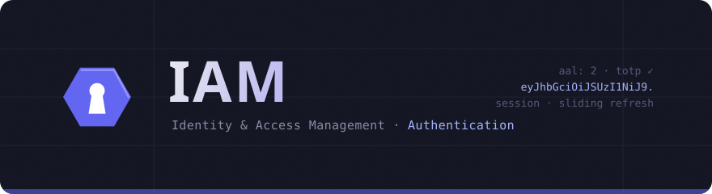

<div align="center">



<br/>

**Headless, multi-tenant authentication** — password & passwordless sign-in,
MFA, OAuth social login, resumable auth flows, an OIDC provider and
SAML/OIDC/SCIM federation, as a SaaS-shaped service (Project + Environment).

<br/>

[](https://gopherex.github.io/iam/)
[](https://github.com/gopherex/iam/actions/workflows/docs.yml)
[](https://go.dev)
[](https://www.postgresql.org)
[](openapi/openapi.yaml)
[](https://gopherex.github.io/iam/sdk/typescript)

**[Documentation](https://gopherex.github.io/iam/)** ·
[Quickstart](https://gopherex.github.io/iam/quickstart) ·
[Concepts](https://gopherex.github.io/iam/concepts/overview) ·
[SDK](https://gopherex.github.io/iam/sdk/typescript) ·
[REST API](https://gopherex.github.io/iam/rest-api/overview) ·
[Self-hosting](https://gopherex.github.io/iam/self-hosting/docker)

</div>

---

IAM authenticates users and manages the identity lifecycle: sign-up/in, email &
phone verification, MFA, sessions, and federation. One Go binary (`cmd/iam`)
serves the runtime API, the project-admin API, the operator API, an OIDC
provider, and an embedded admin panel, backed by PostgreSQL. The HTTP contract
is the single source of truth — [`openapi/openapi.yaml`](openapi/openapi.yaml)
(OpenAPI 3.1) — and both the Go server and the TypeScript SDK
(`@gopherex/iam-sdk`) are generated from it.

## Quickstart

Run the whole thing — server, embedded admin panel, migrations, a seeded `Root`
project — with one command:

```sh
docker compose up
```

Open **http://localhost:8080** and sign in with the master key `dev`.

More: [Quickstart](https://gopherex.github.io/iam/quickstart).

> [!WARNING]
> The compose defaults (master key `dev`, a committed AES key) are for localhost
> only. For anything shared, set a real `IAM_SERVICE_AUTH_ENCRYPTION_KEY`
> (`openssl rand -base64 32`) and `IAM_SERVICE_AUTH_MASTER_KEY` — see
> [Configuration](https://gopherex.github.io/iam/self-hosting/configuration).

## What it gives you

- **Every sign-in method.** Password, email/SMS OTP, magic link, WebAuthn
  passkeys, and OAuth social login — toggled per project.
- **Resumable auth flows.** A server-side state machine drives signup / signin /
  recovery; the client holds only an opaque `flow_token` and survives reloads
  and cross-device continuation.
- **MFA & assurance levels.** TOTP, SMS, email, WebAuthn and recovery codes,
  with AAL1/AAL2 step-up for sensitive operations.
- **Multi-tenant by design.** Projects with isolated `live` / `test` / `staging`
  environments, each with its own config, signing keys and data.
- **OIDC provider + federation.** Be an OIDC IdP for your apps, and connect
  upstream SAML / OIDC / SCIM identity providers.
- **Webhooks & blocking hooks.** Async Standard-Webhooks notifications, plus
  fail-closed hooks that can veto an operation.
- **Sessions done right.** Sliding refresh, reuse detection, device binding, and
  full session management.

## Integrate

```ts
import { createIamClient } from '@gopherex/iam-sdk';

const iam = createIamClient({ baseUrl: 'https://auth.example.com', clientId: 'app_web' });

// resumable signup — email verification handled by the flow
await iam.flow.start({ kind: 'signup', email, password, name });
await iam.flow.verifyEmail({ code });        // → SIGNED_IN on completion

// or a direct password sign-in
const { data, error } = await iam.auth.signInWithPassword({ email, password });
```

Guides: [SDK quickstart](https://gopherex.github.io/iam/guides/sdk-quickstart) ·
[Auth flows](https://gopherex.github.io/iam/guides/auth-flows) ·
[Passwordless](https://gopherex.github.io/iam/guides/passwordless) ·
[MFA](https://gopherex.github.io/iam/guides/mfa).

## Layout

| Path | Purpose |
| --- | --- |
| [`openapi/openapi.yaml`](openapi/openapi.yaml) | the HTTP contract (OpenAPI 3.1) — source of truth |
| [`cmd/iam`](cmd/iam) | the server (API + embedded admin SPA) |
| [`pkg/api`](pkg/api) | hand-written API implementation over the generated server |
| [`pkg/sdk`](pkg/sdk) | Go SDK |
| [`internal/oas/`](internal/oas) | generated ogen code (wire types, server scaffolding) |
| [`internal/infrastructure/postgres/`](internal/infrastructure/postgres) | Postgres store: pgx + pgtx + bob + sqld |
| [`ts/`](ts) | TypeScript SDK (`@gopherex/iam-sdk`) |
| [`web/`](web) | admin panel SPA, embedded into the binary |
| [`website/`](website) | this documentation (Docusaurus) → GitHub Pages |
| [`deployments/`](deployments) | production Dockerfile |
| [`docs/rfc/`](docs/rfc) | reference set of the standards IAM implements |

## Develop

```sh
make help          # list targets
make generate      # regenerate Go (ogen) + TS + DB store from the spec
make dev           # bring up dev infra (docker compose)
make run           # run the server
make test          # unit tests
make test-db       # integration tests (testcontainers; needs Docker)
make build         # build the binary with the embedded admin panel
```

Stack: Go 1.26, PostgreSQL 17, OpenAPI/ogen (contract-first), and the gopherex
libraries (pgtx, sqld/bob, pg-outbox, xconf, xlog, xtrace).

## Scope, honestly

IAM does **authentication** — who you are, and proving it. Authorization
(ReBAC/permissions) is a separate concern and lives in its own service; groups
and tenancy modelling belong there, not here. IAM issues and verifies the
identity your authz layer builds on.

## License

See [LICENSE](LICENSE).
