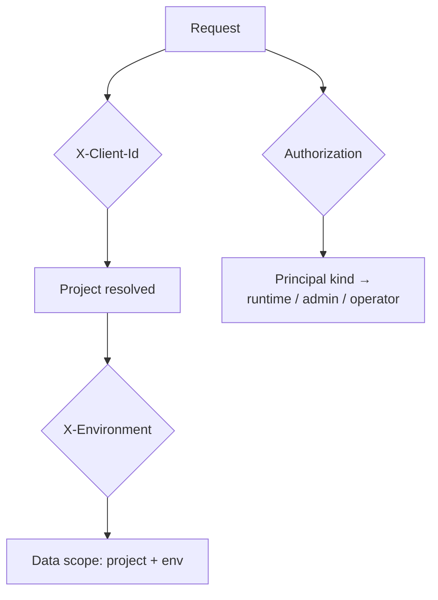

# Concepts overview

A short map of the model before you build. Each concept has its own page.

| Concept | One-liner |
| --- | --- |
| [Projects & environments](/concepts/projects-environments) | A **project** is a tenant; each has isolated **live / test / staging** environments (Stripe-style). |
| [Principals & credentials](/concepts/principals) | Three planes — **operator** (master key), **project admin** (admin token), **end user** (session) — plus service accounts, API keys and SCIM tokens. |
| [Sessions & tokens](/concepts/sessions) | Signed JWT access tokens + rotating refresh tokens, AAL1/AAL2, sliding refresh, per-project session policy. |
| [Registration](/concepts/registration) | `open` / `invite_only` / `request_access` / `closed`, plus password strategy. |
| [MFA](/concepts/mfa) | TOTP, email, SMS, WebAuthn factors + recovery codes; step-up to AAL2. |
| [Webhooks & hooks](/concepts/webhooks-hooks) | Async signed **webhooks** for events; synchronous **blocking hooks** in the auth path. |
| [OIDC & federation](/concepts/oidc-federation) | Be an OIDC provider; connect upstream OIDC/SAML IdPs and SCIM. |
| [Signing keys](/concepts/signing-keys) | RS256 keys per project environment, their rotation, and token profiles. |

## The request model in one picture

Every runtime request identifies:

1. **Which tenant** — the `X-Client-Id` header (the project id).
2. **Which environment** — the `X-Environment` header (`live` by default).
3. **Who is calling** — a bearer credential in `Authorization` (or a cookie for
   browsers), whose *kind* determines which API surface it may touch.

## API namespaces

| Prefix | Audience | Credential |
| --- | --- | --- |
| `/v1/...` | Runtime (end users) | user session (bearer/cookie) + `X-Client-Id` |
| `/v1/projects/{id}/admin/...` | Project admin | `adminToken` |
| `/mgmt/v1/...` | Operator | `masterKey` |
| `/oauth2/...`, `/p/{id}/e/{env}/.well-known/...` | OIDC provider | OAuth client credentials |
| `/v1/scim/v2/{connection_id}/...` | SCIM provisioning | `scimToken` |

The [OpenAPI spec](https://github.com/gopherex/iam/blob/master/openapi/openapi.yaml)
is the authoritative contract for all of them.
