# IAM

**IAM** is a headless, multi-tenant **authentication & identity** server. It gives
your applications sign-up and sign-in, sessions and tokens, MFA, passwordless,
social login, an OIDC provider, SSO federation, and a full admin API — behind a
single HTTP contract, self-hostable from one container.

The HTTP contract is the single source of truth:
[`openapi/openapi.yaml`](https://github.com/gopherex/iam/blob/master/openapi/openapi.yaml)
(OpenAPI 3.1). Everything — the Go server, the TypeScript SDK, the admin panel —
is generated from or verified against it.

> **Scope.** IAM answers *"who is this user"* (authentication). Authorization —
> *"what may they do"* (roles, permissions, ReBAC) — is a **separate** product.
> This documentation covers IAM only.

## What you get

- **Resumable auth flows** — one server-driven state machine for signup, signin,
  recovery and email-change. The client holds an opaque `flow_token`; the server
  holds all state and tells the client the next step. Survives reloads and works
  cross-device.
- **Every sign-in method** — password, email/SMS OTP, magic link, WebAuthn /
  passkeys, and OAuth social login. Step-up MFA (TOTP, email, SMS, WebAuthn,
  recovery codes) with AAL1/AAL2 enforcement.
- **Multi-tenant by design** — many **projects** per instance, each with
  Stripe-like **test / live environment** data isolation.
- **Sessions & tokens** — signed RS256 JWT access tokens, opaque hashed refresh
  tokens with reuse detection, sliding refresh, per-project session policy.
- **OIDC provider + federation** — be an OpenID Connect provider for your apps;
  connect upstream IdPs (OIDC/SAML) and SCIM provisioning.
- **Operations built in** — webhooks, blocking auth hooks, audit logs, bulk
  import/export jobs, risk rules & rate-limit blocks, retention policies — all
  via the admin API.
- **Batteries** — an embedded admin SPA, a first-class TypeScript SDK, and a
  distroless production image.

## How it fits together

```mermaid
flowchart LR
  App["Your app<br/>(TS SDK / REST)"] -->|X-Client-Id + flow_token / bearer| IAM
  Admin["Admin panel /<br/>admin API"] -->|adminToken| IAM
  Op["Operator<br/>(CLI / IaC)"] -->|masterKey| IAM
  IAM["IAM server"] --> PG[("Postgres")]
  IAM -->|webhooks / hooks| Ext["Your backend"]
  IAM -->|OIDC / SAML / SCIM| IdP["Upstream IdPs"]
```

## Three audiences, three credentials

| You are… | You use | You call |
| --- | --- | --- |
| An **end user's app** | `X-Client-Id` + a user session (bearer/cookie) | `/v1/auth/*`, `/v1/users/me`, … |
| A **project admin** | an `adminToken` (bearer) | `/v1/projects/{id}/admin/*` |
| The **operator** | the `masterKey` (bearer) | `/mgmt/v1/*` (create projects, mint admin tokens) |

See [Principals & credentials](/concepts/principals) for the full model.

## Where to go next

- **[Quickstart](/quickstart)** — run IAM locally and make your first sign-in in
  a few minutes.
- **[SDK quickstart](/guides/sdk-quickstart)** — wire the TypeScript SDK into a
  web app.
- **[Concepts](/concepts/overview)** — the model you need before building.
- **[REST API](/rest-api/overview)** — the raw HTTP contract with `curl`
  examples.
- **[Self-hosting](/self-hosting/docker)** — configuration, deployment and
  operations.
